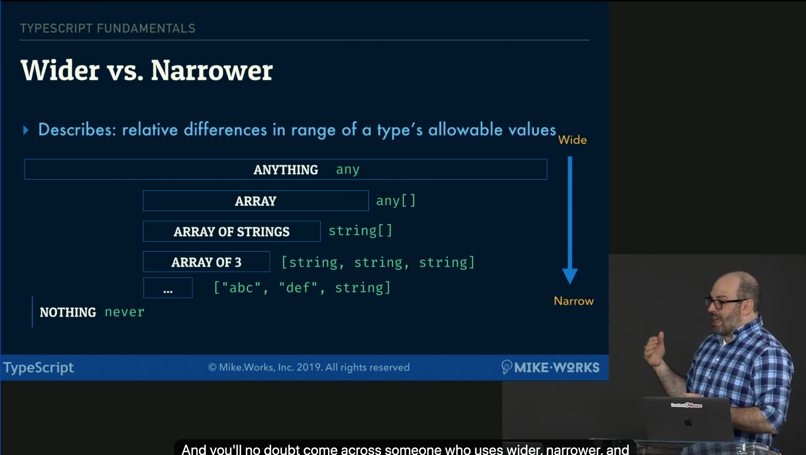

# typescript basics

## variables
- simple vaiables
- arrays and tuples
- objects
- union and intersection types

## Type systems & type equivalence
- `nominal type systems` answer this question based on whether x is an instance of a class/type named HTMLinputElement 
  - ex) Java 
- `structural type systems` only care about the shape of an object
  - ex) TypeScript

- when we talka about the shape of an object, we're referring to the names of properties and types of their values
  - Car: 
    - make: String, 
    - model: String,
    - Year: Number
    only check if Car has those three properties and matching types

- Wider vs Narrower
  - Describes: relative differences in range of a type's allowable values
  - narrower values can always fit through wider values
  

## interface hello {} type hello
- call, construct and index signatures
- open interfaces
- access modifier keywords
- heritage clauses ("extends", "implements")